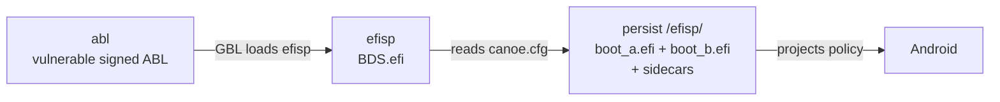

# GBL Root Canoe

[中文版](README_zh.md)


GBL Root Canoe is an EDK2-based workspace for patching EFI applications inside
Qualcomm ABL images. It provides a Fake Locked Bootloader state on Snapdragon
8 Gen 5 / 8 Elite devices: the hardware remains unlocked while the patched
loader presents the locked state required by software checks.

The 7.0.0-b4 release surface adds the `canoe-bootmgr` single-writer core
and the `canoe-ext4` direct ext4 backend. Managed boot artifacts are per-slot
triplets rather than one singular `boot.efi`.

## Boot chain



- `abl` holds a signed, stock, deliberately older ABL with the GBL
  vulnerability.
- `efisp` is not formatted; the operator writes raw `BDS.efi` to it.
- `persist/efisp` is the boot root. Each valid managed slot has a loader and
  matching `.gm2p` (120 bytes) and `.tzmap` (256 bytes) sidecars:
  `boot_a.efi*` and/or `boot_b.efi*`. `boot_backup.efi*` preserves the
  previous generation for the slot most recently updated.

The BDS reads the boot root and never writes storage. The raw BDS is the only
whole-partition image in the chain. On an empty, absent, unreachable, or
unusable boot root, the first-run screen offers **Enter boot menu (Volume Up)**
and **Enter fastboot (default)**; fastboot remains the two-second timeout
default unless Volume Up explicitly opens the menu.

## Five supported scenarios

### 1. Host install

The operator flashes a vulnerable ABL and BDS with fastboot, enters Super
Fastboot, and runs the native host program. The host requests:

```bash
fastboot flash abl <vulnerable>.img       # when the installed ABL is fixed
fastboot flash efisp BDS.efi
./canoe
# Windows: canoe.exe
```

The Deploy stages collect matching stock `images/abl.img` and
`images/vbmeta.img`, then resolve the target slot and mode. When the persisted
mode should be inherited, omit `--mode`:

```bash
canoe build --abl images/abl.img --vbmeta images/vbmeta.img
canoe install --slot a
```

An explicit mode change is a separate reviewed operation; use the Deploy
plan's evidence and acknowledgements rather than treating `--mode` as
sufficient.

For a deliberately supplied local directory, pass `--boot-root`; for an ext4
image or raw block source, use the boot manager's `--source` or `--ext4-image`
backend. These backend choices are mutually exclusive.

### 2. Host update

Build and install the next matching generation with the same host flow. The
selected slot's current triplet is demoted to `boot_backup.efi` with matching
sidecars, and `android-backup` becomes selectable. `android-a` and `android-b`
rows exist only for valid installed triplets; hand-added rows are preserved.

### 3. KernelSU module install

Install the module on a rooted device and open its five-route WebUI. Overview
shows the next action; Deploy owns **Provision → Prepare → Action**. Select a
target mode there only when changing the persisted mode. The module's device
side flow derives the selected per-slot triplet, commits the boot root through
`canoe-bootmgr`, and performs any required device partition writes.

### 4. KernelSU update or post-OTA install

After the system updater finishes an OTA, stay in the current system and,
**before rebooting**, press **Install to inactive slot** in the module WebUI.
The action requires known target-slot metadata, derives and installs only the
next slot's loader triplet and sidecars, and preserves the previous generation
as `boot_backup.efi`. It refuses unknown metadata and never relabels or falls
back to the running slot.

If the action is skipped, the new slot carries a stock ABL without the GBL
exploit. BDS is not loaded, so the device boots stock and unhooked. Nothing is
bricked: boot back to the other slot, or press the action and reboot again. A
managed Mode 2 profile belongs to its installed generation and is refreshed by
this explicit action, never by an OTA. There is no OTA watcher in this release.

### 5. Locked-bootloader temporary root

The Android toolkit's device-side `resources/build.sh` wrapper supports
temporary root from the active slot and invokes the bundled `canoe-bootmgr`
local-directory backend:

```sh
su -c sh ./build.sh --mode 0
su -c sh ./build.sh --mode 1
```

It accepts only Mode 0 and Mode 1, changes the boot-root tree, validates the
generated files, and performs no partition write. `P-FORMAT` acknowledgement is
required only for an observed transition crossing Mode 0 (`R1`); unknown source
mode and KeyMint or signing evidence surface `may` risk instead and never create
a mandatory format blocker. The selected VBMETA is read as target evidence but
is never written. The operator owns the `dd` of the vulnerable ABL and
`BDS.efi` to `efisp`; the retired device-side writers are not part of the
release surface.

## Command surface

The host entry point is the native `canoe` binary on Linux and `canoe.exe` on
Windows, shipped at the toolkit archive root. No Python installation or
bundled interpreter is needed.

```text
canoe
canoe build [--abl IMG] [--vbmeta IMG]
canoe install [--boot-root PATH] --slot A|B [--mode 0|1|2] [--from-mode 0|1|2] \
              [--acknowledge CODE]... \
              [--vendor-boot IMG] [--allow-new-signer]
canoe entry|config|default|bls|slot|source ...
canoe -h | --help | --version
canoe --non-interactive <command> ...
```

With no arguments, `canoe` starts the interactive five-route operator surface.
`--non-interactive` is accepted and discarded for compatibility. The
`entry|config|default|bls|slot|source` verbs are forwarded verbatim to
`canoe-bootmgr`.

The canonical single-writer API is `canoe-bootmgr`:

```text
canoe-bootmgr [--boot-root DIR | --source SOURCE | --ext4-image IMAGE] <command>
canoe-bootmgr ... install --staged DIR --slot a|b [--mode 0|1|2] [--from-mode 0|1|2] \
             [--id ID] [--acknowledge CODE]... \
             [--current-vbmeta PATH] [--target-vbmeta PATH] [--target-image PATH]
canoe-bootmgr ... ota-apply --staged DIR --target-slot a|b [--mode 0|1|2] [--from-mode 0|1|2] \
             [--id ID] [--acknowledge CODE]... \
             [--current-vbmeta PATH] [--target-vbmeta PATH] [--target-image PATH]
canoe-bootmgr ... slot status
canoe-bootmgr ... bls list
```

`--boot-root` selects a local directory; `--source` and `--ext4-image` select
the direct ext4 backend and are mutually exclusive with it. The host `canoe`
surface uses the BDS export as its direct source when `--boot-root` is omitted.
Omit `--mode` to inherit the persisted mode. For an existing managed entry,
`--id <ENTRY_ID>` supplies the current-mode evidence; for a new row, supply
`--from-mode 0|1|2` explicitly. A mode change must also repeat
`--acknowledge <CODE>` for every acknowledgement required by `mode.plan`.
When the plan needs image evidence, pass `--current-vbmeta`, `--target-vbmeta`,
and `--target-image`; these paths are evidence inputs, not implicit flash
payloads. The writer evaluates `mode.plan` before mutating the boot root, so a
refusal or missing acknowledgement leaves it untouched.

For example, an existing row can request a reviewed mode change:

```text
canoe-bootmgr ... install --staged DIR --slot a --mode 1 --id android-a \
  --current-vbmeta CURRENT_VBMETA --target-vbmeta TARGET_VBMETA \
  --target-image TARGET_IMAGE \
  --acknowledge CODE_1 --acknowledge CODE_2
```

For a new row, provide the prior mode explicitly instead of `--id`:

```text
canoe-bootmgr ... install --staged DIR --slot a --mode 1 --from-mode 0 \
  --acknowledge CODE_1 --acknowledge CODE_2
```

Mode 1 graft preparation is an optional task inside Deploy → Prepare. It
enumerates the selected VBMETA's chain descriptors, verifies any generated
image, and only then offers its partition write.

The `vendor_boot` patch keeps the image size and section offsets fixed. It adds
the kernel module blacklist and the vendor ramdisk's Android `modules.blocklist`
entry together, so recovery skips the guard instead of failing a required load.
Recompression may use existing zero page padding; unsupported ramdisks or a
patch that cannot fit are refused. No external boot-image binary is bundled.

## Signer limitation

A successful Mode 2 derivation means only that `vbmeta` parsed and carries a
signature and public-key blob. No tool here can prove which key is the OEM's.
The automatic protection is limited to detecting whether the public-key digest
changed since the last installed generation. Such a change is expected when
moving to or from a custom ROM; the host requires `--allow-new-signer`, while an
explicitly supplied device `vbmeta` declares that choice.

## Building packages

Build from a Linux development host:

```bash
make target_toolkit_linux
make target_toolkit_windows
make target_toolkit_android
make target_magisk_module
```

The Linux and Android toolkits contain `extractfv`, `patch_abl`,
`mode2_profile`, `abl_tzmap`, `canoe-bootmgr`, and `canoe-ext4`; the Windows
toolkit contains their `.exe` forms and pinned `fastboot.exe`. Windows
installation passes the exported `\\.\PhysicalDrive<N>` source directly to
`canoe-ext4`; no third-party filesystem driver or drive letter is required.

See the [installation guide](wiki/docs/install.md),
[configuration contract](wiki/docs/canoe-cfg.md), and
[USB Mass Storage guide](wiki/docs/mass-storage.md).

## License and history

The project is GPL-2.0-or-later. [`ARCHIVE.md`](ARCHIVE.md) records historical
6.x material; the current release surface is the five scenarios above.
