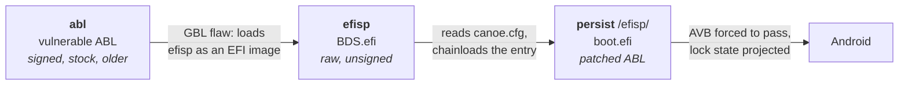

# GBL Root Canoe

[中文版](README_zh.md)

`gbl_root_canoe` is an EDK2-based workspace for patching the EFI applications inside Qualcomm ABL (Android Bootloader) images. Its purpose is a **Fake Locked Bootloader** state on Snapdragon 8 Gen 5 / 8 Elite (Gen 5) devices: the bootloader is really unlocked, but everything that asks reports locked, so bootloader-unlock detection passes.

> **Status:** active again. This tree was archived at 6.x; [ARCHIVE.md](ARCHIVE.md) is kept for that history. The current milestone is **7.0.0-b1**, which is a redesign rather than a bug-fix release — see [What changed in 7.x](#what-changed-in-7x).

### How the boot chain works

Three partitions matter, and the names are not arbitrary — each one is a step in the chain:



1. **`abl`** holds a *signed, stock, deliberately older* ABL. It is genuine vendor code, so the boot ROM accepts it. Its one interesting property is a GBL (Generic Bootloader Loader) flaw that makes it load the raw `efisp` partition as an EFI image without verifying it. That flaw is the only foothold in the whole design; nothing here defeats a signature.
2. **`efisp`** is the EFI System Partition. It is not formatted — `BDS.efi` is written to it raw, and the vulnerable ABL executes it. This is our code, and the only thing on that partition.
3. **`persist`** is an ordinary ext4 partition that survives a factory reset. Its `efisp/` subdirectory is the **boot root**: `canoe.cfg`, the patched ABL `boot.efi`, and that ABL's two sidecars. `BDS.efi` reads the config, renders a menu, and chainloads the chosen `boot.efi`, which then boots Android with AVB forced to pass and the lock state projected.

The reason the patched ABL lives on `persist` rather than in `abl` is that `abl` must keep its real vendor signature to be loaded at all. So the signed-but-old ABL stays where the boot ROM looks, and the patched-but-current one is chainloaded from a data partition where nothing checks it.

Two sidecars sit beside `boot.efi`, both derived per-image and both matched to it: `boot.efi.gm2p` is a 120-byte KeyMint profile derived from the matching stock `vbmeta`, and `boot.efi.tzmap` is a 256-byte `GTZM` TrustZone interface map derived from the **unpatched** ABL. Both are generated locally at install time and are not shipped in the archives.

### What changed in 7.x

**The BDS no longer writes to storage.** 6.x kept three 1 KiB records in the tail of the raw `efisp` partition — preferred mode, default entry, custom entry — and the boot menu wrote them. Two things were wrong with that. A `dd` of a new `BDS.efi` writes only the image length, so a stale record outlived the loader that wrote it and a mode chosen under one build silently applied under the next. And it made the bootloader a writer, on a device that is one failed boot away from EDL.

7.x replaces all three with one declarative file, [`canoe.cfg`](wiki/docs/canoe-cfg.md), on the boot root. The BDS reads it and renders it. There is exactly one writer: `tools/canoe-device/canoe_boot_entry.sh`, the same script called by the host toolkit, the KernelSU module, and the OTA watcher. Its `set` operation is an UPSERT: it replaces only the named entry and preserves every other entry, including hand-added custom-ROM entries.

The shared installer keeps the boot-root transaction in `canoe_device_install.sh`; the entry writer is a separate shared script so all three callers use identical config logic. Both scripts have real read-write access to `persist`, which the BDS's read-only ext4 driver never did.

Consequences worth knowing:

- **Boot policy is per boot entry**, not one global switch. The `.gm2p` and `.tzmap` sidecars were always per-image; a global mode made a mismatch representable, and per-entry does not.
- **The backup entry is an ordinary third row**, alongside the two A/B slots, distinguished by `role backup`. The BDS derives no slot state of its own — whoever wrote the config already knew which slot was live.
- **The `efisp` partition is untouched by the loader** and holds nothing but `BDS.efi`.
- **First run is detected**, not guessed: an empty boot root sends the device straight to Super Fastboot, which is the only channel that can install anything.

---

## Builder Guide

This section is for developers who want to compile the toolkits from source.

### Prerequisites

You must be on a **Linux** host to build the project:
- `gcc` / `clang`, `lld`, `make`, `zip`, `python3`
- `pytest` — development dependency for the host-tool test suite (`make test`)
- Rust toolchain (`cargo`/`rustup`) for the native and cross-compilation targets
- `liblzma-dev` (for compiling `extractfv`)
- **Android NDK** (required for `make target_magisk_module` to cross-compile tools for Android)
- **MinGW-w64**

### Host tools

The PC-side implementation is the `canoelib/` Python package. The same package is copied into both toolkit archives. Linux needs Python 3.11+; Windows needs no separate Python installation because its archive includes an embeddable CPython under `python/`.

The intended human workflow is the interactive wizard:

```text
Linux:   ./canoe
Windows: canoe.cmd
```

The wizard asks, in order:

1. whether this is the first install or an update;
2. which boot mode to use;
3. in Mode 1, whether to proceed after warning that a custom recovery must be grafted with the vbmeta tool, flashed, and then returned to;
4. in Mode 1, whether to patch `vendor_boot`;
5. for the matching stock `abl.img` and `vbmeta.img`, which must match the firmware being booted and must be stock, while watching `images/` until both are present if it starts empty;
6. whether to generate a boot entry; and
7. a readable result.

For scriptable and CI use, the same entry point exposes these subcommands. On Windows, use `canoe.cmd` in place of `canoe`:

```text
canoe                              interactive wizard (default, no arguments)
canoe build                        derive the ABL/profile/map artifacts
canoe prep [--pkg ...]             prepare a firmware package
canoe prep-device [--slot ...]     pull a device pair and derive artifacts
canoe install [--via adb|mass-storage] [--boot-root PATH]
                                   install the boot root and upsert its boot entry
canoe oneshot --abl  --mode 0|1
                                   temporary, non-interactive boot
The host implementation is shared; the archive's `README.canoe.md` contains its platform-specific packaging notes.


The one-shot command is the non-interactive path for a locked bootloader when the stock image is already known:

```bash
canoe oneshot --abl  --mode 0
# or --mode 1
```

The supplied image is expected to be stock and already known to match the device. One-shot obtains root for that launch only and writes nothing permanent.

### Build Targets

**Note:** You **do not** need to provide an `abl.img` to build the distributable toolkits or module.

- **`make target_toolkit_linux`**
  Builds the superfastboot BDS (`BDS.efi`) from the `uefi` submodule and compiles the toolkit utilities (`extractfv`, `patch_abl`, `mode2_profile`, `abl_tzmap`) for Linux. `mode2_profile` exposes only `derive` and `validate` for the matching profile; `abl_tzmap` derives and validates the local 256-byte `boot.efi.tzmap` from the unpatched ABL.

- **`make target_toolkit_windows`**
  Same as above, but cross-compiles the utilities (`extractfv.exe`, `patch_abl.exe`, `mode2_profile.exe`, `abl_tzmap.exe`) into Windows `.exe` programs using MinGW-w64.

- **`make target_magisk_module`**
  Cross-compiles the toolkit utilities (`extractfv`, `patch_abl`, `mode2_profile`, `abl_tzmap`) for Android using your NDK, builds the BDS, and packages everything as a KernelSU/Magisk module.

- **`make target_toolkit_android`**
  Produces a standalone Android arm64 toolkit (`toolkit_android.zip`) with Android-native binaries (`extractfv`, `patch_abl`, `mode2_profile`, `abl_tzmap`) for on-device use outside of the module.

---

## User Guide

For more detailed instructions, please refer to the [Wiki](https://github.com/1vivy/gbl_root_canoe/wiki).

### 1. Using the Module (On-Device)

The module is designed to run directly on your rooted Android device.

**Requirements:**
- Device must be Snapdragon 8 Gen 5 / 8 Elite (Gen 5).
- KernelSU module path only: the kernel must permit writes to `abl` and `efisp`. Baseband Guard blocks them; a kernel that allows them (WildKernel reportedly does now) works. If writes are refused, switch to LKM or stock boot images. The host toolkit route does not need kernel write permission: its bootloader bundle flashes both partitions with fastboot.
- The ABL on the `abl` partition must contain the GBL vulnerability. If it does not, flash an older ABL with the vulnerability first; the generated `boot.efi` and its sidecars must still be a matching stock firmware set.

**Installation & Usage:**
The device-side module's first-install flow asks, in order: whether this is the first installation, which mode to use, whether to proceed after the Mode 1 custom-recovery graft warning, and (in Mode 1) whether to patch `vendor_boot`. It then shows a readable result and automatically reboots to Recovery after a countdown so you can format data. A later install is a plain install with no questions.

The module's OTA watcher runs in the background. When an OTA changes the ABL on the inactive slot, it detects the real change, re-derives that slot's pair, and adds a new entry to `canoe.cfg` with the correct role. It leaves the entry that currently boots in place; the previously working entry is never removed. You do not need to reopen the WebUI and flash again after every OTA. The WebUI mode selector remains available: it rewrites the named `canoe.cfg` entry rather than a partition record.

### 2. Using the PC Toolkits (Linux / Windows)

The wizard is the recommended human path. Unpack `target_toolkit_linux` or `target_toolkit_windows`, then run `./canoe` on Linux or `canoe.cmd` on Windows and follow its prompts. Put the matching **stock** `abl.img` and `vbmeta.img` in `images/`; the wizard says what is missing and waits there until the pair is populated.
For repeatable scripts, the same archive provides the subcommands below. Installation is split into two bundles:

- **Bundle 1 — bootloader (host only):** if the installed ABL lacks the GBL vulnerability, flash the older vulnerable ABL, then flash BDS:

  ```bash
  fastboot flash abl <vulnerable>.img
  fastboot flash efisp BDS.efi
  ```

  Omit the first command when the installed ABL already has the vulnerability. This bundle uses fastboot only; it does not involve Android or kernel writes.
- **Bundle 2 — boot root and boot entry:** install or refresh the boot root at `<persist mount>/efisp`, then derive the slot triplet and upsert its `canoe.cfg` entry. The default ADB route stages over ADB from custom recovery or a rooted system and runs the shared transaction on the device: `canoe install --via adb`. For the BDS export, `canoe install --via mass-storage` asks the running BDS to perform `fastboot oem mass-storage:persist`, waits for the USB disk, and mounts it; with an already-mounted persist filesystem, use `canoe install --boot-root <mount>`. The same bundle is also the OTA update path.

The boot root cannot come from fastboot. `persist` is a live ext4 filesystem holding vendor calibration, so `fastboot flash persist` would replace the filesystem. The raw BDS is the only part of this chain that is a whole-partition image.

`canoe install` validates and stages the complete set, then invokes the shared transaction and entry writer. The installer snapshots the live set and prior backup, keeps the previous generation as the selectable backup entry, syncs the persist tree before committing it, and rolls the set back if a commit fails. The entry writer's UPSERT preserves other entries, including hand-added custom-ROM entries; see the normative [canoe.cfg format](wiki/docs/canoe-cfg.md).

### Windows ext4 access

The Windows archive bundles `platform-tools`. Its ext4 read/write path uses **WinFsp plus LKL `lklfuse`**. Those components are fetched and SHA-256-verified on first use; they are not vendored in this repository. This is the path for mounting `persist` after the BDS exports it over USB Mass Storage and editing the boot root directly when ADB is unavailable.

### 3. OTA Upgrade

After an OTA, the module's background watcher notices a changed ABL on the inactive slot, verifies the change against the digest recorded at install, re-derives the pair for that slot, and adds it to `canoe.cfg` with the right role. It leaves the currently booting entry in place and never removes the previously working entry. There is no manual WebUI reflash step to remember after each OTA. If you want to change the mode of an entry, use the WebUI mode selector; it names the entry it rewrites.

### 4. Superfastboot Usage Instructions

When OEM Unlocking is enabled and the white warning text appears on boot, press **Volume Up** to enter Superfastboot mode (the BDS).

On first run, if the boot root has neither `canoe.cfg` nor `boot.efi`, the BDS shows a first-run screen and goes straight to Super Fastboot. There is nothing to boot; fastboot is the only channel that can install anything.

The boot menu includes **Reboot to Recovery** and **USB Mass Storage**. USB Mass Storage exports one partition at a time as a normal USB disk:

- `persist` contains the boot root at `/efisp`; it is the repair channel when a device has no working ADB. The BDS warns before exporting it because it is a live filesystem.
- `logfs` is offered only when that partition exists and is useful for pulling boot logs from a device that will not boot.
- Only one partition (one USB LUN) can be exported per session. **Volume Down** ends the session.

The same feature is reachable from fastboot:

```bash
fastboot oem mass-storage             # persist (the default)
fastboot oem mass-storage:persist     # persist
fastboot oem mass-storage:logfs       # logfs
```

The menu's mode row is a **session override**. It applies to the next launch and is never written anywhere. An entry with its own configured mode ignores that row because its `.gm2p`/`.tzmap` sidecars are bound to that exact policy. The persisted fallback policy is the file-global `mode` in [`canoe.cfg`](wiki/docs/canoe-cfg.md).

For DeviceInfo repair, a Mode 1 or Mode 2 launch repairs the backing
`DeviceInfo` only when the observed state does not already satisfy the requested
mode. `devinfo-repair never` in `canoe.cfg` refuses that repair; the launch then
continues honestly in Mode 0. Mode 0 is hook-free passthrough and neither reads
nor writes `DeviceInfo`. The observed state is always recorded in the boot log.

See the [USB Mass Storage guide](wiki/docs/mass-storage.md) for the complete export and Windows mount procedure.

Common commands include:
- **Temp-boot BDS in RAM (nothing is written to flash):**
  ```bash
  fastboot stage <BDS.efi>
  fastboot oem boot-efi
  ```
- **Lock and Unlock (BL related):**
  - Lock BL, triggers a data wipe: `fastboot flashing lock`
  - Unlock BL, no data wipe: `fastboot flashing unlock` or `fastboot flashing unlock_critical`
  - *Note: If the TEE status is inconsistent, the device will refuse to provide the data key, rendering data inaccessible.*
- **Flashing and Erasing:**
  - `fastboot flash <partition> <file.img>`
  - `fastboot erase <partition>`
- **Rebooting:**
  - `fastboot reboot bootloader` (next normal boot enters Official Fastboot)
  - `fastboot reboot recovery`
  - `fastboot reboot`

### 5. File Reference

1. `BDS.efi`: The superfastboot BDS, flashed raw to the `efisp` partition.
2. `canoe.cfg`: The declarative boot-root configuration, including the file-global fallback mode and the per-entry modes and roles. Its format is specified in [`wiki/docs/canoe-cfg.md`](wiki/docs/canoe-cfg.md).
3. `boot.efi` / `boot.efi.gm2p` / `boot.efi.tzmap`: The patched ABL, its matching 120-byte locked/green KeyMint profile from stock vbmeta, and the 256-byte TrustZone map from the unpatched ABL, placed on `persist` under `efisp/`; the map is generated locally and is not shipped in the archive.
4. `ABL_original.efi`: The original unpatched ABL extracted for analysis; do not flash it to `efisp`.
