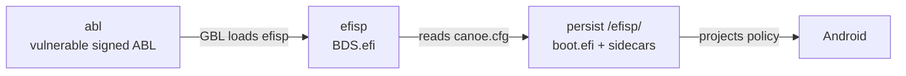

# GBL Root Canoe

[中文版](README_zh.md)


GBL Root Canoe is an EDK2-based workspace for patching EFI applications inside
Qualcomm ABL images. It provides a Fake Locked Bootloader state on Snapdragon
8 Gen 5 / 8 Elite devices: the hardware remains unlocked while the patched
loader presents the locked state required by software checks.

## Boot chain



- `abl` holds a signed, stock, deliberately older ABL with the GBL
  vulnerability.
- `efisp` is not formatted; the operator writes raw `BDS.efi` to it.
- `persist/efisp` is the boot root. It contains `canoe.cfg`, the patched
  `boot.efi`, and its matching `.gm2p` and `.tzmap` sidecars.

The BDS reads the boot root and never writes storage. `boot.efi.gm2p` is a
120-byte profile derived from matching `vbmeta`; `boot.efi.tzmap` is a 256-byte
map derived from the unpatched ABL. The raw BDS is the only whole-partition
image in the chain.

## Five supported scenarios

### 1. Host install

The operator flashes a vulnerable ABL and BDS with fastboot, enters Super
Fastboot, and runs the interactive Python program. The host reaches the boot
root only through `fastboot oem mass-storage:persist`.

```bash
fastboot flash abl <vulnerable>.img       # when the installed ABL is fixed
fastboot flash efisp BDS.efi
./canoe
# Windows: canoe.cmd
```

The questionnaire waits for matching stock `images/abl.img` and
`images/vbmeta.img`, asks for slot and mode, and commits the selected generation
to `persist/efisp`.

### 2. Host update

Build and install the next matching generation with the same host flow. The
current triplet is demoted to `boot_backup.efi` with matching sidecars, and
`android-backup` becomes selectable. Hand-added rows are preserved.

### 3. KernelSU module install

Install the module on a rooted device and follow its bilingual first-install
questionnaire. Select Mode 0, 1, or 2. Mode 1 asks for the recovery vbmeta graft
and whether to patch the `vendor_boot` cmdline. The module derives from device
partitions by default, commits the boot root, and performs its required device
partition writes.

The two derivation sources can independently use non-empty supplied files at
`/data/local/tmp/canoe/abl.img` and `/data/local/tmp/canoe/vbmeta.img`. The
default is always the corresponding device partition; a supplied image is never
a flash payload.

### 4. KernelSU update or post-OTA install

After installing an OTA, before rebooting, press **Flash To Other Slot** in the
module WebUI. It derives and installs the loader for the slot that will boot
next, refreshes its sidecars, labels the active row for that slot, and copies a
vulnerable ABL there when required.

If the action is skipped, the new slot carries a stock ABL without the GBL
exploit. BDS is not loaded, so the device boots stock and unhooked. Nothing is
bricked: boot back to the other slot, or press the action and reboot again. A
managed Mode 2 profile belongs to its installed generation and is refreshed by
this action, never by an OTA. Automatic post-OTA patching is deliberately
deferred.

### 5. Locked-bootloader temporary root

The Android toolkit's device-side shell wrapper supports temporary root from
the active slot:

```sh
su -c sh ./build.sh --mode 0
su -c sh ./build.sh --mode 1
```

It accepts only Mode 0 and Mode 1, changes the boot-root tree, and performs no
partition write. Optional `--abl PATH` and `--vbmeta PATH` values select supplied
derivation inputs. The operator owns the `dd` of the vulnerable ABL and
`BDS.efi` to `efisp`.

## Command surface

The host entry point is the same on Linux and Windows (`canoe` or `canoe.cmd`):

```text
canoe
canoe build [--abl IMG] [--vbmeta IMG]
canoe install [--boot-root PATH] --slot a|b [--mode 0|1|2] \
              [--vendor-boot IMG] [--allow-new-signer]
```

`canoe build` defaults to `images/abl.img` and `images/vbmeta.img`; supplied
values are copied there before derivation. `canoe install` uses the BDS export
when `--boot-root` is omitted, or an already mounted `persist/efisp` otherwise.
The host implementation is Python and never invokes a shell.

For Mode 1 recovery preparation, use the standalone graft tool:

```text
vbmetaport <official recovery vbmeta> <custom recovery.img> <output.img>
```

The output must not grow. The `vendor_boot` feature is a fixed-offset cmdline
amendment; no boot-image binary is bundled.

## Signer limitation

A successful Mode 2 derivation means only that `vbmeta` parsed and carries a
signature and public-key blob. No tool here can prove which key is the OEM's.
The automatic protection is limited to detecting whether the public-key digest
changed since the last installed generation. Such a change is expected when
moving to or from a custom ROM; the host requires `--allow-new-signer`, while an
explicitly supplied device `vbmeta` declares that choice.

## Building packages

Build from a Linux development host:

```bash
make target_toolkit_linux
make target_toolkit_windows
make target_toolkit_android
make target_magisk_module
```

The Linux and Android toolkits contain `extractfv`, `patch_abl`,
`mode2_profile`, and `abl_tzmap`; the Windows toolkit contains their `.exe`
forms. Windows also bundles pinned `fastboot.exe`, Ext4Windows, and WinFsp.
Ext4Windows is read-only by default, so mounting the exported disk for an
installation requires:

```text
ext4windows.exe mount \\.\PhysicalDrive<N> Z: --rw
```

If mounting fails, run `ext4windows.exe --scan`, mount the volume manually, and
rerun `canoe.cmd install --boot-root <drive>:\efisp` with its required slot and
mode. See the [installation guide](wiki/docs/install.md),
[configuration contract](wiki/docs/canoe-cfg.md), and
[USB Mass Storage guide](wiki/docs/mass-storage.md).

## License and history

The project is GPL-2.0-or-later. [`ARCHIVE.md`](ARCHIVE.md) records historical
6.x material; the current release surface is the five scenarios above.
