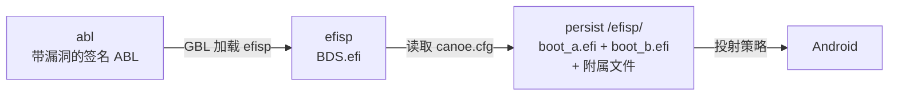

# GBL Root Canoe

[English](README.md)

GBL Root Canoe 是一个基于 EDK2 的工作区，用于修补高通 ABL 镜像中的 EFI
程序。它在骁龙 8 Gen 5 / 8 Elite 设备上实现假回锁状态：硬件仍处于解锁，
但已修补的加载器向软件呈现所需的锁定状态。

7.0.0-b2 的发布界面加入 `canoe-bootmgr` 单一写入核心、双语
`canoe-gui` 主机适配器和 `canoe-ext4` 直接 ext4 后端。受管理的启动产物
按槽位组织为三件套，不再使用单一的 `boot.efi`。

## 启动链


- `abl` 保存签名、原厂且有意保持较旧的带 GBL 漏洞 ABL；
- `efisp` 不格式化，由操作员将 `BDS.efi` 原始写入；
- `persist/efisp` 是启动根目录。每个有效受管理槽位都有加载器及匹配的
  `.gm2p`（120 字节）和 `.tzmap`（256 字节）附属文件：
  `boot_a.efi*` 和/或 `boot_b.efi*`。`boot_backup.efi*` 保存最近更新槽位的
  上一世代。

BDS 读取启动根目录，从不写入存储。原始 BDS 是启动链中唯一的 whole-partition
image。启动根目录为空、缺失、无法访问或不可用时，首次运行界面提供
**Enter boot menu (Volume Up)** 与 **Enter fastboot (default)**；fastboot
是两秒超时默认值，只有 Volume Up 会明确打开菜单。

## 五种支持的场景

### 1. 电脑端首次安装

操作员使用 fastboot 刷入带漏洞的 ABL 和 BDS，进入 Super Fastboot，再运行原生
主机程序：

```bash
fastboot flash abl <vulnerable>.img       # 当前 ABL 已修复时执行
fastboot flash efisp BDS.efi
./canoe
# Windows：canoe.exe
```

问卷会等待匹配的原厂 `images/abl.img` 和 `images/vbmeta.img`，询问槽位与模式，
然后通过 `canoe-ext4` 将导出的原始源直接交给 `canoe-bootmgr`。不需要主机文件
系统目录或盘符：

```bash
canoe build --abl images/abl.img --vbmeta images/vbmeta.img
canoe install --slot a --mode 1
```

如果明确提供本地目录，使用 `--boot-root`；如果使用 ext4 镜像或原始块源，使用
boot manager 的 `--source` 或 `--ext4-image` 后端。两类后端选项互斥。

### 2. 电脑端更新

使用同一电脑端流程构建并安装下一套匹配世代。目标槽位的当前三件套会连同匹配
附属文件降为 `boot_backup.efi`，并生成可选择的 `android-backup`。
只有有效三件套才会生成 `android-a` 和 `android-b` 行；手动添加的启动项会被保留。

### 3. KernelSU 模块安装

在已 Root 的设备上安装模块，按中英文首次安装问卷操作，选择 Mode 0、1 或 2。
模块的设备端流程派生所选槽位三件套，通过 `canoe-bootmgr` 提交启动根目录，
并执行所需的设备分区写入。

### 4. KernelSU 更新或 OTA 后安装

系统更新器完成 OTA 后，保持在当前系统中，并且**在重启前**在模块 WebUI
按下 **Install to inactive slot**。该操作要求已知的目标槽位元数据，只派生并
安装下一个槽位的加载器三件套及附属文件，并将上一世代保留为 `boot_backup.efi`。
未知元数据会被拒绝，绝不会重新标记或回退到运行中的槽位。

如果跳过该操作，新槽位带有没有 GBL 漏洞的原厂 ABL。BDS 不会加载，设备会以
原厂状态启动且没有挂钩。不会变砖：返回另一个槽位启动，或执行该操作后再次
重启。受管理的 Mode 2 profile 属于安装世代，只由该明确操作刷新，OTA 本身
不会刷新。此版本不包含 OTA watcher。

### 5. 锁定 Bootloader 的临时 root

Android 工具包中的设备端 `resources/build.sh` 包装器从活动槽位提供临时
root，并调用捆绑的 `canoe-bootmgr` 本地目录后端：

```sh
su -c sh ./build.sh --mode 0
su -c sh ./build.sh --mode 1
```

它只接受 Mode 0 和 Mode 1，只改变启动根目录树，验证生成文件且不写入分区。
易受攻击的 ABL 和 `BDS.efi` 到 `efisp` 的 `dd` 由操作员自行负责；退役的
设备端写入器不属于当前发布界面。

## 命令界面

Linux 使用原生 `canoe`，Windows 使用原生 `canoe.exe`；二者都位于工具包归档
根目录。不需要安装 Python，也不再捆绑解释器或使用启动脚本。

```text
canoe
canoe build [--abl IMG] [--vbmeta IMG]
canoe install [--boot-root PATH] --slot A|B [--mode 0|1|2] \
              [--vendor-boot IMG] [--allow-new-signer]
canoe entry|config|default|bls|slot|source ...
canoe -h | --help | --version
canoe --non-interactive <command> ...
```

不带参数时，`canoe` 启动交互式五种场景问卷。`--non-interactive` 会被接受并
丢弃，以保持兼容；`entry|config|default|bls|slot|source` 子命令会原样转发给
`canoe-bootmgr`。

规范的单一写入 API 是 `canoe-bootmgr`：

```text
canoe-bootmgr [--boot-root DIR | --source SOURCE | --ext4-image IMAGE] <command>
canoe-bootmgr ... install --staged DIR --slot a|b --mode 0|1|2
canoe-bootmgr ... slot status
canoe-bootmgr ... bls list
```

`--boot-root` 选择本地目录；`--source` 与 `--ext4-image` 选择直接 ext4 后端，
并与其互斥。省略 `--boot-root` 时，电脑端 `canoe` 使用 BDS 导出的直接源。

双语图形界面使用同一协议：

```text
canoe-gui [--boot-root DIR | --source IMAGE] [--zh]
```

Mode 1 的 Recovery 准备使用独立 graft 工具：

```text
vbmetaport <official recovery vbmeta> <custom recovery.img> <output.img>
```

输出大小不得增加。`vendor_boot` 功能是固定偏移的命令行修改，不附带 boot-image
二进制。

## 签名限制

成功的 Mode 2 派生只能说明 `vbmeta` 已解析并带有签名和公钥 blob，不能说明密钥
属于 OEM；本工具无法证明这一点。自动保护仅检测公钥摘要是否相对于上一安装世代
发生变化。切换到或切换回 Custom ROM 时，变化是预期的；电脑端需要
`--allow-new-signer`，而明确提供设备端 `vbmeta` 即表示操作员作出该选择。

## 构建发布包

在 Linux 开发主机上构建：

```bash
make target_toolkit_linux
make target_toolkit_windows
make target_toolkit_android
make target_magisk_module
```

Linux 与 Android 工具包包含 `extractfv`、`patch_abl`、`mode2_profile`、
`abl_tzmap`、`canoe-bootmgr` 和 `canoe-ext4`；Windows 工具包包含对应
`.exe` 以及固定版本的 `fastboot.exe`。Windows 安装会将导出的
`\\\\.\\PhysicalDrive<N>` 原始源直接交给 `canoe-ext4`；不需要第三方文件
系统驱动或盘符。双语 `canoe-gui` 主机适配器使用同一个 boot manager 协议。

详见[安装指南](wiki/docs/zh/install.md)、[`canoe.cfg` 契约](wiki/docs/zh/canoe-cfg.md)
和 [USB Mass Storage 指南](wiki/docs/zh/mass-storage.md)。

## 许可证与历史

项目采用 GPL-2.0-or-later。旧版 6.x 内容记录在 [`ARCHIVE.md`](ARCHIVE.md)；当前
发布界面仅包含上面的五种场景。
